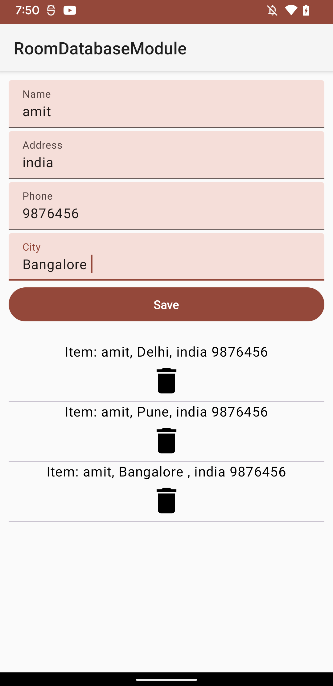

# Room Database Demo Project 📊

Welcome to the Room Database Demo project! This project is designed to help you understand and implement the Room Persistence Library in an Android application. Room is a powerful and efficient library provided by Android that simplifies the process of working with SQLite databases while also offering additional features like compile-time verification of SQL queries and support for LiveData.

In this demo project, you'll learn how to:

1. Set up the Room Database in your Android application. 🛠️
2. Define entities to represent your data in the database. 📑
3. Create Data Access Objects (DAOs) to perform database operations. 🏗️
4. Use LiveData to observe changes in the database. 📡

## Getting Started 🚀

To get started with this demo project, follow these steps:

1. Clone the repository to your local machine.
   ```
   git clone https://github.com/your-username/room-database-demo.git
   ```

2. Open the project in Android Studio.

3. Run the application on an emulator or physical device to see the practical implementation of Room Database.

## Project Structure 📂

The project is organized as follows:

- `app` module: Contains the main Android application code.
  - `room`: Contains the Room database setup, entities, DAOs, and database-related classes.
  - `ui`: Contains activities to demonstrate the usage of the database.
  
- `build.gradle`: Contains the project-level and module-level build configurations.

## Screenshot

- 

## Implementation Steps 🛠️

1. **Setting up Room Database**: We've already set up the Room database in the `AppDatabase` class. This class is the main access point to the database and should be initialized as a singleton.

2. **Defining Entities**: The `UserEntity` class in the `data.entities` package represents a simple entity that can be stored in the database. You can define additional entities here to suit your project's needs.

3. **Creating Data Access Objects (DAOs)**: The `UserDao` interface in the `data.dao` package defines methods to interact with the database. You can create additional DAOs for different entities.

4. **Using Livedata or State**: In the `ui` package, you'll find an example activity that demonstrates how to use LiveData to observe changes in the database and update the UI accordingly.

## Resources 📚
- [Medium article for setting up room](https://amitraikwar.medium.com/getting-started-with-room-database-in-android-fa1ca23ce21e)
- [Room Persistence Library Documentation](https://developer.android.com/topic/libraries/architecture/room)
- [Android Architecture Components](https://developer.android.com/topic/libraries/architecture)

## License 📄

This demo project is released under the [MIT License](LICENSE).

Feel free to explore, modify, and use this project to enhance your understanding of Room Database in Android applications. Happy coding! 🚀
